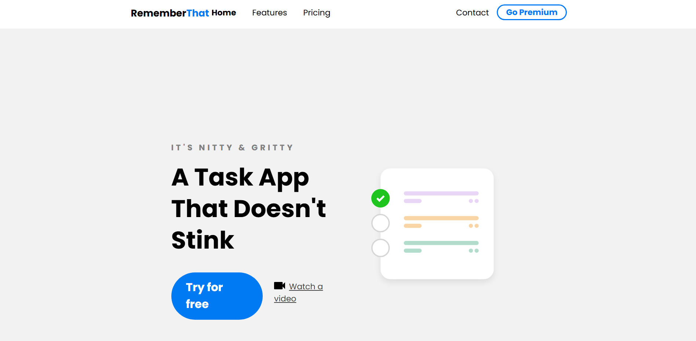

# 🚀 RememberThat – Landing Page Responsiva

✨ Uma **landing page moderna e responsiva**, criada com **HTML + SCSS + JavaScript**, focada em boa estrutura, design limpo e navegação mobile intuitiva 📱💻

━━━━━━━━━━━━━━━━━━━━━━━

##📸 Preview
---

━━━━━━━━━━━━━━━━━━━━━━━

## ✨ Visão Geral

🔹 Layout responsivo (mobile, tablet e desktop)  
🔹 Menu mobile animado com JavaScript  
🔹 SCSS organizado com variáveis, nesting e media queries  
🔹 Estrutura semântica bem separada por seções  

━━━━━━━━━━━━━━━━━━━━━━━

## 🧱 Estrutura do Projeto

📁 **HTML**
▫ Navbar com menu mobile  
▫ Hero section com CTA  
▫ Lista de features em grid  
▫ Seção de depoimentos  
▫ Formulário de contato + Google Maps  

━━━━━━━━━━━━━━━━━━━━━━━

## 🎨 CSS vs SASS vs SCSS – Qual a Diferença?

Antes de entrar no **SCSS**, é importante entender a diferença entre **CSS**, **SASS** e **SCSS**, pois eles impactam diretamente na organização e manutenção do estilo do projeto.

### 🧱 CSS (Cascading Style Sheets)
📌 Linguagem padrão para estilizar páginas web.  
✔ Não precisa compilar  
✔ Simples e direto  
❌ Pouco escalável para projetos grandes  

### 🧠 SASS
📌 Pré-processador de CSS com sintaxe indentada.  
✔ Código mais enxuto  
✔ Ideal para projetos maiores  
❗ Precisa ser compilado antes de usar no navegador  

### 🚀 SCSS
📌 Versão mais popular do SASS, com sintaxe parecida com CSS.  
✔ Variáveis  
✔ Nesting  
✔ Mixins e funções  
✔ Código organizado e escalável  

━━━━━━━━━━━━━━━━━━━━━━━

## 🎨 SCSS – Organização e Boas Práticas

✔ Layout responsivo com múltiplos breakpoints:
📱 Mobile first
📱 Tablet (768px)
💻 Desktop (1080px)
🖥️ Telas grandes (1450px)

━━━━━━━━━━━━━━━━━━━━━━━

⚙️ JavaScript – Menu Mobile Interativo

📌 Controle simples e eficiente do menu mobile usando JavaScript puro.

🔹 Funcionamento
▫ Clique no ícone ☰ → menu aparece
▫ Clique no ❌ → menu fecha
▫ Controle feito com classList

━━━━━━━━━━━━━━━━━━━━━━━

📐 Responsividade

🔸 Mobile: menu lateral oculto
🔸 Tablet: layout adaptado
🔸 Desktop: menu visível
🔸 Ultra wide: elementos decorativos extras

━━━━━━━━━━━━━━━━━━━━━━━

🧩 Funcionalidades

✅ Menu mobile animado
✅ Hero section com CTA
✅ Lista de features estilizada
✅ Depoimentos personalizados
✅ Formulário de contato
✅ Google Maps incorporado

━━━━━━━━━━━━━━━━━━━━━━━

🛠️ Tecnologias Utilizadas

🧱 HTML5
🎨 SCSS
⚙️ JavaScript (Vanilla)
🌍 Google Fonts
🗺️ Google Maps

━━━━━━━━━━━━━━━━━━━━━━━